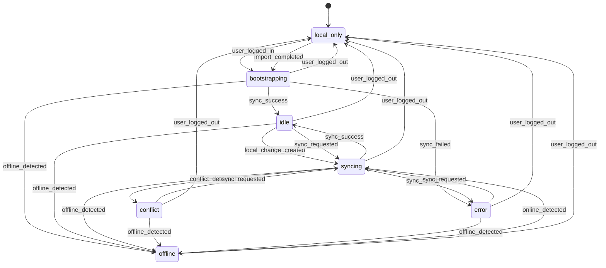

# Client Sync State Machine

## Цель

Зафиксировать будущую клиентскую sync state machine до начала backend skeleton и runtime-реализации.

Сейчас LifeQuest остаётся local-first приложением. Этот документ описывает, как клиент должен вести себя после появления account mode и серверной синхронизации.

## Sync statuses

- `local_only`
- `idle`
- `bootstrapping`
- `syncing`
- `offline`
- `conflict`
- `error`

## Смысл статусов

### local_only

- приложение работает без аккаунта;
- все данные живут локально;
- sync queue не используется.

### idle

- аккаунт уже есть;
- bootstrap выполнен;
- активной синхронизации сейчас нет;
- клиент готов принимать локальные изменения и складывать их в queue.

### bootstrapping

- клиент только что вошёл в аккаунт;
- идёт `GET /api/sync/bootstrap`;
- локальный cache подготавливается к account mode.

### syncing

- клиент выполняет `push`, `pull` или комбинированный sync cycle;
- queue items могут быть в состоянии `syncing`;
- новые локальные изменения не теряются и добавляются в queue дальше.

### offline

- сеть пропала в account mode;
- клиент продолжает local-first работу;
- pending queue сохраняется до восстановления сети.

### conflict

- сервер вернул конфликтующие изменения;
- автоматическое разрешение не покрывает ситуацию полностью;
- клиент должен показать conflict handling UI позже.

### error

- произошла нерешаемая ошибка синхронизации;
- автоматический retry остановлен;
- пользователю позже будет доступен manual retry или мягкий recovery flow.

## События

- `app_started`
- `user_logged_in`
- `user_logged_out`
- `local_change_created`
- `online_detected`
- `offline_detected`
- `sync_requested`
- `sync_success`
- `sync_failed`
- `conflict_detected`
- `import_completed`

## Основные переходы

### Local-first и вход в аккаунт

- `local_only -> bootstrapping` после `user_logged_in`
- `bootstrapping -> idle` после `sync_success` bootstrap
- `bootstrapping -> error` при unrecoverable bootstrap error
- `bootstrapping -> offline` если сеть пропала во время bootstrap

### Обычная синхронизация

- `idle -> syncing` при `local_change_created`, если account mode уже активен
- `idle -> syncing` при `sync_requested`
- `syncing -> idle` при `sync_success`
- `syncing -> conflict` при `conflict_detected`
- `syncing -> error` при `sync_failed`, если ошибка non-retryable

### Работа без сети

- `idle -> offline` при `offline_detected`
- `syncing -> offline` при `offline_detected`
- `conflict -> offline` при потере сети во время конфликта
- `error -> offline` если одновременно есть network loss
- `offline -> syncing` при `online_detected`, если есть pending queue или нужен pull
- `offline -> idle` при `online_detected`, если ничего не нужно синхронизировать

### Возврат в local-only режим

- любой account-backed статус -> `local_only` после `user_logged_out`

### Импорт локального backup в аккаунт

- `local_only -> bootstrapping` после `import_completed` и последующего account bootstrap

## State machine на уровне продукта



## Sync queue

### Зачем нужна очередь

- в account mode любая локальная мутация должна переживать offline и временные ошибки;
- local-first UX не должен ждать ответа сервера;
- queue позволяет отправлять операции позже и повторять их безопасно.

### Структура queue item

```ts
interface SyncQueueItem {
  id: string
  userId: string
  deviceId: string
  entityType: SyncCollectionKey
  entityId: string
  operation: 'create' | 'update' | 'delete' | 'complete' | 'reward'
  payload: unknown
  createdAt: string
  attempts: number
  lastAttemptAt?: string | null
  status: 'pending' | 'syncing' | 'failed' | 'resolved'
  idempotencyKey: string
}
```

### Правила очереди

- каждая мутация в account mode должна создавать `SyncQueueItem`
- в local mode queue не нужен
- одна и та же операция должна быть идемпотентной
- `reward`-операции обязаны содержать `sourceId`, чтобы не начислять XP повторно
- queue item не удаляется мгновенно после успеха, а сначала переводится в `resolved`
- failed items остаются в очереди до retry или ручного разрешения

### Примеры операций

- создание quest -> `operation: create`
- обновление route -> `operation: update`
- удаление quest -> `operation: delete`
- completion quest -> `operation: complete`
- начисление XP/reward -> `operation: reward`

## Практический жизненный цикл клиента

### App started

- если режим `local`, статус = `local_only`
- если режим `account` и есть cursor/queue, клиент проверяет сеть и решает между `idle`, `bootstrapping` или `offline`

### Local change created

- в local mode change применяется локально и не идёт в queue
- в account mode change применяется локально и одновременно пишет queue item

### Online detected

- если account mode и есть pending queue, клиент идёт в `syncing`
- если queue пустая, можно ограничиться pull/health-check и вернуться в `idle`

### User logged out

- sync queue больше не используется
- клиент возвращается в `local_only`
- local-first данные не должны ломаться из-за logout

## Что не делать на клиенте

- не блокировать UI ожиданием sync roundtrip
- не терять локальные изменения из-за временной ошибки
- не начислять reward повторно при retry
- не смешивать transient UI state с sync state

## useSyncStore contract

`useSyncStore` хранит только клиентское sync-состояние и queue contract. Он не должен заменять domain stores и не должен брать на себя бизнес-логику самих сущностей.

### Поля

- `status`: текущий sync status клиента
- `queue`: локальная очередь будущих операций для account mode
- `latestSyncCursor`: курсор последней успешной синхронизации
- `lastSyncAt`: время последнего завершённого sync cycle
- `lastError`: последняя ошибка sync-слоя
- `conflicts`: конфликты, требующие resolution
- `retryPolicy`: конфигурация retry
- `networkOnline`: runtime-снимок сети
- `deviceId`: стабильный идентификатор устройства

### Actions

- `bootstrapLocalSync()`
- `setNetworkOnline(value)`
- `enqueueChange(item)`
- `markItemSyncing(id)`
- `markItemResolved(id)`
- `markItemFailed(id, error)`
- `clearResolvedItems()`
- `setStatus(status)`
- `setLastError(error)`
- `setConflicts(conflicts)`
- `clearConflicts()`
- `resetSyncState()`
- `initializeDeviceId()`

### Как это будет использоваться позже

- после логина client bootstrap сможет заполнить `deviceId`, курсор и status
- локальные изменения в account mode будут вызывать `enqueueChange`
- sync runner later будет переключать item-статусы через `markItemSyncing / markItemResolved / markItemFailed`
- conflict handling UI later будет читать `conflicts` и вызывать `clearConflicts`

### Почему сейчас store не делает сетевых запросов

- backend ещё не реализован
- auth пока placeholder
- local-first UX не должен зависеть от несуществующей сети
- store фиксирует контракт и persist-модель заранее, чтобы backend later подключался к уже согласованному клиентскому интерфейсу, а не наоборот

## Текущий runtime-слой readiness

На текущем этапе `useSyncStore` уже связан с auth session, но всё ещё не выполняет `bootstrap / push / pull`.

### Что уже делает клиент

- после `useAuthStore.bootstrap()` приложение инициализирует `deviceId`;
- если пользователь остаётся в local mode, sync status фиксируется как `local_only`;
- если пользователь аутентифицирован, sync status переходит в `idle`, а при отсутствии сети — в `offline`;
- `window.navigator.onLine` и события `online/offline` обновляют только readiness-состояние;
- `Settings` показывают sync status, last sync, длину очереди и короткий `deviceId`.
- `Settings` могут вручную запустить `bootstrapAccountSync()`.
- `Settings` также могут вручную загрузить `settingsProfile` с сервера или сохранить локальные настройки в аккаунт.

### Что принципиально ещё не делает клиент

- не вызывает `/api/sync/bootstrap` автоматически на каждом входе или рендере
- не вызывает `/api/sync/push`
- не вызывает `/api/sync/pull`
- не переносит local data в account автоматически
- не запускает queue runner
- не синхронизирует автоматически `settingsProfile` в фоне, даже если account mode уже активен

### Что уже делает ручной bootstrap

- вызывает только `GET /api/sync/bootstrap`
- обновляет `latestSyncCursor`, `lastSyncAt`, `conflicts` и sync status
- не перезаписывает local-first collections данными сервера
- нужен сейчас как безопасная проверка account sync readiness

### Что уже делает ручной sync настроек

- вызывает `GET /api/settings/profile` только по кнопке `Загрузить настройки с сервера`
- вызывает `PUT /api/settings/profile` только по кнопке `Сохранить настройки в аккаунт`
- синхронизирует только `userName`, `userRole`, `preferredTone`
- не трогает `quests`, `today`, `progress`, `body`, `money` и другие домены

### Logout-поведение

- logout возвращает sync store в `local_only`
- queue, conflicts и ошибки сбрасываются через `resetSyncState()`
- `deviceId` сохраняется, потому что устройство остаётся тем же
- local-first данные пользователя не удаляются
